# Cirrostrats Backend - System-Level Architecture Diagram

## System Architecture Overview

```mermaid
graph TB
    %% External Systems
    subgraph "External APIs & Data Sources"
        FS[FlightStats Web Scraping]
        FA[FlightAware API]
        NAS[FAA NAS API]
        WS[Weather Services]
        ND[Newark Departures Scraping]
        AS[Aviation Stack API]
    end

    %% Client Layer
    subgraph "Client Layer"
        WEB[Web Frontend<br/>React/Vue]
        MOBILE[Mobile App]
        API_CLIENT[API Clients]
    end

    %% Load Balancer & Gateway
    subgraph "Infrastructure Layer"
        LB[Load Balancer<br/>Nginx]
        DOCKER[Docker Containers]
    end

    %% Application Layer
    subgraph "Application Layer"
        FASTAPI[FastAPI Backend<br/>main.py]
        
        subgraph "API Routes"
            SEARCH_ROUTES[Search Routes<br/>/searches/*]
            FLIGHT_ROUTES[Flight Routes<br/>/ajms/*, /flightStatsTZ/*]
            WEATHER_ROUTES[Weather Routes<br/>/weather/*]
            GATE_ROUTES[Gate Routes<br/>/gates/*]
            NOTIF_ROUTES[Notification Routes<br/>/notifications/*]
            MISC_ROUTES[Misc Routes<br/>/nas/*]
        end
        
        subgraph "Service Layer"
            SEARCH_SVC[Search Service<br/>Fuzzy Search, Query Classification]
            FLIGHT_SVC[Flight Aggregator Service<br/>Multi-source Data Aggregation]
            WEATHER_SVC[Weather Service<br/>METAR/TAF/DATIS Processing]
            GATE_SVC[Gate Service<br/>Gate Information Processing]
            NOTIF_SVC[Notification Service<br/>Telegram Integration]
            MISC_SVC[Misc Service<br/>NAS Data Processing]
        end
        
        subgraph "Core Business Logic"
            QC[Query Classifier<br/>Search Index Management]
            FF[Fuzzy Finder<br/>Search Ranking]
            EDCT[EDCT Lookup<br/>Departure Clearance Times]
            WP[Weather Parser<br/>Aviation Weather Processing]
            GP[Gate Processor<br/>Gate Data Processing]
        end
    end

    %% Background Processing
    subgraph "Background Processing"
        CELERY[Celery Worker<br/>Task Queue]
        REDIS[Redis<br/>Message Broker & Cache]
        
        subgraph "Scheduled Tasks"
            DATIS_TASK[DATIS Fetch<br/>Every 10 mins]
            METAR_TASK[METAR Fetch<br/>Every 53 mins]
            TAF_TASK[TAF Fetch<br/>Every 4 hours]
            GATE_TASK[Gate Fetch<br/>Every 2 hours]
            NAS_TASK[NAS Fetch<br/>Every minute]
            TEST_TASK[Generic Testing<br/>Every 3 hours]
        end
    end

    %% Data Layer
    subgraph "Data Storage"
        subgraph "MongoDB Atlas - Primary DB"
            AIRPORTS_COL[airports<br/>Airport Information]
            WEATHER_COL[airport-weather<br/>Weather Data]
            FLIGHTS_COL[flights<br/>Flight Information]
            GATES_COL[ewrGates<br/>Gate Data]
            SEARCH_COL[Search Tracking<br/>User Search History]
            ICAO_COL[icao_iata<br/>Airport Code Mapping]
        end
        
        subgraph "Local Data Files"
            PKL_FILES[Pickle Files<br/>Static Data Cache]
            JSON_FILES[JSON Files<br/>Configuration Data]
        end
    end

    %% Notification System
    subgraph "Notification System"
        TELEGRAM[Telegram Bot<br/>Real-time Alerts]
    end

    %% Development & Testing
    subgraph "Development Tools"
        JUPYTER[Jupyter Notebooks<br/>Development & Testing]
        TESTS[Test Suite<br/>Broad Testing Framework]
    end

    %% Connections - Client to Application
    WEB --> LB
    MOBILE --> LB
    API_CLIENT --> LB
    LB --> DOCKER
    DOCKER --> FASTAPI

    %% API Routes to Services
    FASTAPI --> SEARCH_ROUTES
    FASTAPI --> FLIGHT_ROUTES
    FASTAPI --> WEATHER_ROUTES
    FASTAPI --> GATE_ROUTES
    FASTAPI --> NOTIF_ROUTES
    FASTAPI --> MISC_ROUTES

    SEARCH_ROUTES --> SEARCH_SVC
    FLIGHT_ROUTES --> FLIGHT_SVC
    WEATHER_ROUTES --> WEATHER_SVC
    GATE_ROUTES --> GATE_SVC
    NOTIF_ROUTES --> NOTIF_SVC
    MISC_ROUTES --> MISC_SVC

    %% Services to Core Logic
    SEARCH_SVC --> QC
    SEARCH_SVC --> FF
    FLIGHT_SVC --> EDCT
    WEATHER_SVC --> WP
    GATE_SVC --> GP

    %% Services to Data Layer
    SEARCH_SVC --> AIRPORTS_COL
    SEARCH_SVC --> SEARCH_COL
    FLIGHT_SVC --> FLIGHTS_COL
    WEATHER_SVC --> WEATHER_COL
    GATE_SVC --> GATES_COL
    MISC_SVC --> ICAO_COL

    %% Core Logic to Data Files
    QC --> PKL_FILES
    WP --> JSON_FILES

    %% Background Processing
    CELERY --> REDIS
    CELERY --> DATIS_TASK
    CELERY --> METAR_TASK
    CELERY --> TAF_TASK
    CELERY --> GATE_TASK
    CELERY --> NAS_TASK
    CELERY --> TEST_TASK

    %% Scheduled Tasks to External APIs
    DATIS_TASK --> WS
    METAR_TASK --> WS
    TAF_TASK --> WS
    GATE_TASK --> ND
    NAS_TASK --> NAS

    %% Scheduled Tasks to Data Storage
    DATIS_TASK --> WEATHER_COL
    METAR_TASK --> WEATHER_COL
    TAF_TASK --> WEATHER_COL
    GATE_TASK --> GATES_COL
    NAS_TASK --> REDIS

    %% External API Integration
    FLIGHT_SVC --> FA
    FLIGHT_SVC --> AS
    FLIGHT_SVC --> FS
    WEATHER_SVC --> WS

    %% Notification System
    NOTIF_SVC --> TELEGRAM
    NAS_TASK --> TELEGRAM
    TEST_TASK --> TELEGRAM

    %% Development Tools
    JUPYTER --> FASTAPI
    TESTS --> CELERY

    %% Styling
    classDef external fill:#e1f5fe
    classDef application fill:#f3e5f5
    classDef data fill:#e8f5e8
    classDef background fill:#fff3e0
    classDef notification fill:#fce4ec

    class FA,AS,NAS,WS,FS,ND external
    class FASTAPI,SEARCH_ROUTES,FLIGHT_ROUTES,WEATHER_ROUTES,GATE_ROUTES,NOTIF_ROUTES,MISC_ROUTES,SEARCH_SVC,FLIGHT_SVC,WEATHER_SVC,GATE_SVC,NOTIF_SVC,MISC_SVC,QC,FF,EDCT,WP,GP application
    class AIRPORTS_COL,WEATHER_COL,FLIGHTS_COL,GATES_COL,SEARCH_COL,ICAO_COL,PKL_FILES,JSON_FILES data
    class CELERY,REDIS,DATIS_TASK,METAR_TASK,TAF_TASK,GATE_TASK,NAS_TASK,TEST_TASK background
    class TELEGRAM notification
```

## Key System Components

### 1. **Application Layer**
- **FastAPI Backend**: Main REST API server with CORS middleware
- **Route Modules**: Organized API endpoints for different functionalities
- **Service Layer**: Business logic abstraction
- **Core Logic**: Specialized processing modules

### 2. **Background Processing**
- **Celery**: Distributed task queue for scheduled operations
- **Redis**: Message broker and caching layer
- **Scheduled Tasks**: Automated data fetching and processing

### 3. **Data Storage**
- **MongoDB Atlas**: Primary database with multiple collections
- **Local Files**: Pickle and JSON files for static data and caching

### 4. **External Integrations**
- **Flight APIs**: FlightAware, Aviation Stack, FlightStats
- **Weather Services**: METAR, TAF, DATIS data sources
- **FAA NAS**: National Airspace System status
- **Web Scraping**: Newark departures, gate information

### 5. **Notification System**
- **Telegram Bot**: Real-time alerts and monitoring

## Data Flow Patterns

1. **Real-time Requests**: Client → FastAPI → Services → MongoDB
2. **Scheduled Data Fetching**: Celery → External APIs → MongoDB
3. **Search Operations**: Client → Search Service → Fuzzy Matching → Results
4. **Background Processing**: Celery → Redis → External APIs → Data Storage
5. **Notifications**: System Events → Telegram Bot → Users

## Deployment Architecture

- **Docker Containerization**: All services containerized
- **Load Balancing**: Nginx for request distribution
- **Cloud Database**: MongoDB Atlas for scalability
- **Message Queue**: Redis for task coordination
